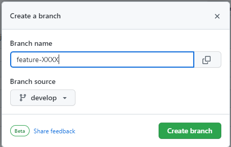

# TechLabo-Java-SpringBoot

## 1. 前提条件
以下がローカルPCにインストールされていること

- JDK17
  - 環境変数(jAVA_HOME)も設定済であること
  - 例：JAVA_HOME=C:\work\java\jdk-17.0.1
- Git
  - TortiseGitがあると便利
- IDE
  - Eclipse, Intellij IDE, VSCode等お好きなものでOK

## 2. 実行方法
1. コマンドプロンプトを起動
2. リポジトリのクローンを作成

```
git clone https://github.com/udonkot/TechLabo-Java-SpringBoot.git
```

3. クローンしたフォルダに移動し、developブランチをチェックアウト
```
cd TechLabo-Java-SpringBoot
git checkout develop
```

4. 以下コマンドを実行。もしくはIDEからTechLabo4SpringBootApplicationを実行
```
mvnw clean install
mvnw spring-boot:run
```

5. localhost:8080にアクセスし、画面が表示されれば成功！

## 3. 利用方法(初回：featureブランチ作成～作業用フォルダ作成)

1. featureブランチを作成する。GitHub上で操作するとやりやすい



```
ブランチ名は「feature-[ユーザ名]」
```

2. 作成したfeatureブランチをローカルリポジトリにチェックアウトする。
```
cd TechLabo-Java-SpringBoot
git checkout [featureブランチ名]
```

3. ユーザ向けのControllerクラスを新規作成する。<br/>
以下クラスファイルを参考に作成
```
igdxserv.TechLabo4SpringBoot.rooms.template.controller.TemplateController
※パッケージを含む"template"の部分をユーザ名に変更する。
```

4. ユーザ向けのhtmlファイルを新規作成する。<br/>
以下htmlファイルを参考に作成
```
resources/templates/rooms/template/
※ユーザ名のフォルダ、main.htmlを作成する。
※main.htmlの"Template Room Main"を任意の値に修正する
```

5. テンプレートファイルを更新する。<br/>
以下htmlファイルを修正する
```
resources/templates/rooms/sidebar.html
※aタグを追加する。href属性名は"/rooms/[ユーザ名]/home" 
```

6. 「3．～5．」で作成、更新したファイルをfeatureブランチにコミット／プッシュする<br/>
developブランチで作業していた場合はブランチを切り替えること

7. プルリクエストを作成する。マージ先はdevelopブランチ


